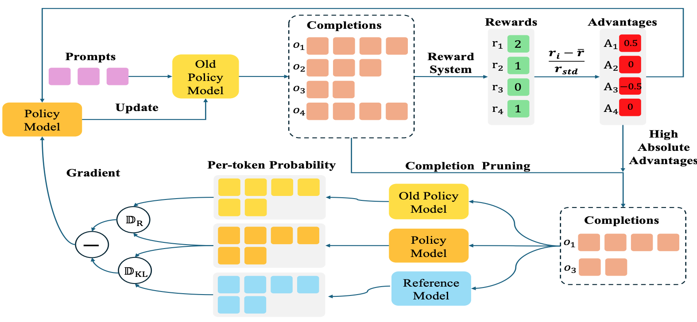

<h2 id="publications" style="margin: 2px 0px -15px;">Publications</h2>

<h3 id="2024" style="margin: 20px 2px -15px;">2024</h3>

<ol class="bibliography">

<li>

  

    
    <abbr class="badge">ECCV 2024</abbr>
  

  

    
<a href="../assets/files/Accdiffusion.pdf">AccDiffusion: An Accurate Method for Higher-Resolution Image Generation</a>

    
<strong>Zhihang Lin, Mingbao Lin, Meng Zhao, Rongrong Ji</strong>

    
<em>European Conference on Computer Vision <strong>(ECCV)</strong>, Jul. 2024.</em>

    

      <a href="../assets/files/Accdiffusion.pdf" class="btn btn-sm z-depth-0" role="button" target="_blank" style="font-size:12px;">PDF</a>
      <a href="../assets/files/Accdiffusion_supplement.pdf" class="btn btn-sm z-depth-0" role="button" target="_blank" style="font-size:12px;">Supplement</a>
      <a href="https://github.com/lzhxmu/AccDiffusion" class="btn btn-sm z-depth-0" role="button" target="_blank" style="font-size:12px;">Code</a>
      <a href="../accdiffusion/accdiffusion.html" class="btn btn-sm z-depth-0" role="button" target="_blank" style="font-size:12px;">Pages</a>
      <!-- <strong><i style="color:#7b5aa6">arXiv.org</i></strong> -->
    

  

</li>

<li>

  

    
    <abbr class="badge">AAAI 2025</abbr>
  

  

    
<a href="https://arxiv.org/html/2405.05803v1">Boosting Multimodal Large Language Models with Visual Tokens Withdrawal for Rapid Inference</a>

    
<strong>Zhihang Lin, Mingbao Lin, Luxi Lin, Rongrong Ji</strong>

    
<em>Association for the Advance of Artificial Intelligence <strong>(AAAI Oral)</strong>, December 2024.</em>

    

      <a href="https://arxiv.org/html/2405.05803v1" class="btn btn-sm z-depth-0" role="button" target="_blank" style="font-size:12px;">PDF</a>
      <a href="https://github.com/lzhxmu/VTW" class="btn btn-sm z-depth-0" role="button" target="_blank" style="font-size:12px;">Code</a>
      <!-- <a href="https://dblp.uni-trier.de/rec/conf/cvpr/LiuSLSS20.html?view=bibtex" class="btn btn-sm z-depth-0" role="button" target="_blank" style="font-size:12px;">BibTex</a> -->
      <!-- <strong><i style="color:#7b5aa6">arXiv.org</i></strong> -->
    

  

</li>
  
<h3 id="2025" style="margin: 20px 2px -15px;">2025</h3>

 

<li>

  

    
    <abbr class="badge">Arxiv</abbr>
  

  

    
<a href="https://arxiv.org/pdf/2503.22342">CPPO: Accelerating the Training of Group Relative
Policy Optimization-Based Reasoning Models</a>

    
<strong>Zhihang Lin, Mingbao Lin, Yuan Xie, Rongrong Ji</strong>

    
<em><strong>Arxiv</strong>, March 2025.</em>

    

      <a href="https://arxiv.org/pdf/2503.22342" class="btn btn-sm z-depth-0" role="button" target="_blank" style="font-size:12px;">PDF</a>
      <a href="https://github.com/lzhxmu/CPPO" class="btn btn-sm z-depth-0" role="button" target="_blank" style="font-size:12px;">Code</a>
    

  

</li>

 

</ol>

